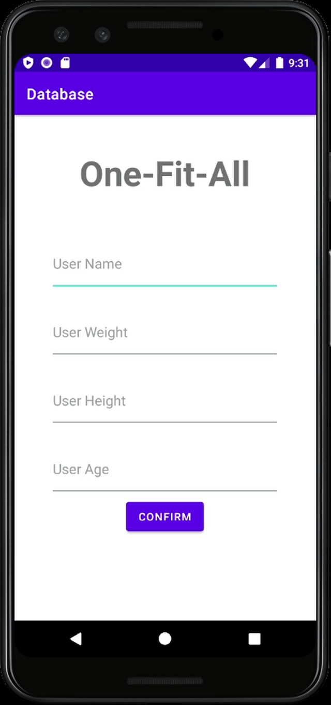
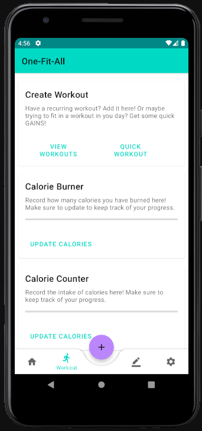
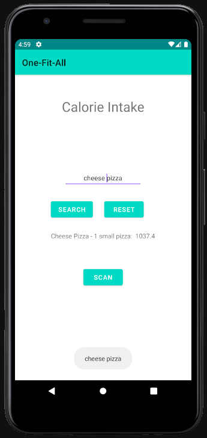

# One Fit All Fitness Application

---

### Table of Contents
You're sections headers will be used to reference location of destination.

- [Description](#description)
- [How To Use](#how-to-use)
- [Author Info](#author-info)
- [License](#License)
- [References](#references)

---

## Description
Android application with the goal of making its user healthier
and incorporate fitness into their daily routine. One-Fit-All 
aims to make peoples fitness and health experience greater by being the swiss army knife of fitness and health applications. This is accomplished by including features to track caloric intake, monitor fitness activity, supply custom workout routines, journaling, and music control. One-Fit-All will allow users to utilize all these features from just the palm of their hand.

#### Technologies

- Android Studio
- Spotify Android API
- SQLite
- MVVM with architecture components

[Back To The Top](#read-me-template)

---

## How To Use

Very simple to use download onto Android device and follow instructions onscreen in order to use the application. On an android device, located our website OneFitAll.com and download the Android APK provided. You must have sufficient storage in order to download the application and an Android device with Android 11 or higher.

[Back To The Top](#read-me-template)

---

## References
[Back To The Top](#read-me-template)

---

## License

MIT License

Copyright (c) [2017] [Alfred Guimaztdinov]

Permission is hereby granted, free of charge, to any person obtaining a copy
of this software and associated documentation files (the "Software"), to deal
in the Software without restriction, including without limitation the rights
to use, copy, modify, merge, publish, distribute, sublicense, and/or sell
copies of the Software, and to permit persons to whom the Software is
furnished to do so, subject to the following conditions:

The above copyright notice and this permission notice shall be included in all
copies or substantial portions of the Software.

THE SOFTWARE IS PROVIDED "AS IS", WITHOUT WARRANTY OF ANY KIND, EXPRESS OR
IMPLIED, INCLUDING BUT NOT LIMITED TO THE WARRANTIES OF MERCHANTABILITY,
FITNESS FOR A PARTICULAR PURPOSE AND NONINFRINGEMENT. IN NO EVENT SHALL THE
AUTHORS OR COPYRIGHT HOLDERS BE LIABLE FOR ANY CLAIM, DAMAGES OR OTHER
LIABILITY, WHETHER IN AN ACTION OF CONTRACT, TORT OR OTHERWISE, ARISING FROM,
OUT OF OR IN CONNECTION WITH THE SOFTWARE OR THE USE OR OTHER DEALINGS IN THE
SOFTWARE.

[Back To The Top](#read-me-template)

---

## Author Info

- Linkedin - [@Alfred Guimaztdinov](https://www.linkedin.com/in/alfred-guimaztdinov-856a29167/)
- Website - [One Fit All](https://www.sandbox.csun.edu/~spm84381/OneFitAll/index.html)

    Group comprised of Emil Shigin, Steven Marquez, Alfred Guimaztdinov, Randy Flores Mateo, Ian Moskowitz, Charles Balcom, and Aaron Park
[Back To The Top](#read-me-template)

---
  
